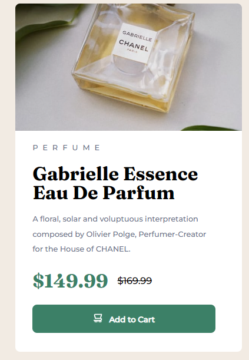

# Frontend Mentor - Product preview card component solution

This is a solution to the [Product preview card component challenge on Frontend Mentor](https://www.frontendmentor.io/challenges/product-preview-card-component-GO7UmttRfa). Frontend Mentor challenges help you improve your coding skills by building realistic projects. 

## Table of contents

- [Overview](#overview)
  - [The challenge](#the-challenge)
  - [Screenshot](#screenshot)
  - [Links](#links)
- [My process](#my-process)
  - [Built with](#built-with)
  - [What I learned](#what-i-learned)
  - [Continued development](#continued-development)
  - [Useful resources](#useful-resources)
- [Author](#author)
- [Acknowledgments](#acknowledgments)

**Note: Delete this note and update the table of contents based on what sections you keep.**

## Overview

### The challenge

Users should be able to:

- View the optimal layout depending on their device's screen size
- See hover and focus states for interactive elements

### Screenshot

### Links

- Solution URL: [Frontend Mentor Solution](https://www.frontendmentor.io/solutions/using-vanilla-htmlcss-for-product-review-card-ypY_yCPwEB)
- Live Site URL: [Github Pages](https://ilyemm.github.io/product-review-card/)

## My process

From the last challenge, I learned that building the outer container first is a good idea, so that's what I did with this. Starting off with the outer card, I decided to split it into the image and the product information. With the product information, I thought it'd be a good idea to divide the information into the header, title of the product, the description, the pricing with both prices in a single container, and lastly the button. 

With all of that figured out in the HTML, I moved on to the CSS where I mistakenly only focused on the desktop view and built it out initialy with percentages and pixels. I used "mistakenly" here because whatever I did messed up my future progress when I moved onto the mobile view. 

For the life of me, I could not figure out how to make the image and product information be the same width without something go wrong. I had to take a step back and ended up reading comments I got from my challenge attempt for the Results Summary Component! 

Reading the comments and absorbing some more knowledge, I came back to the files and re-did the pixels into rem to make it more responsive. Additionally, I learned what box-sizing was and learned that's what it needed to align the images and product information without sacrificing the integrity of the product description. 

From all the rework I did, I was able to land on this! I'm pretty proud of it because I was actually planning to scrap all the progress and redo it. Thankfully, reading resources helped me save time and the work I did. 

Practice makes perfect, but reading up resources along the way helps speed up the perfection too! 

### Built with

- Semantic HTML5 markup
- CSS custom properties
- Flexbox

### What I learned

I learned about rem and why it's better to use it for sizing compared to pixels. I did some more flex reading and was able to use it instead of the table tag from my previous attempt to make the design more responsive! :) 

### Continued development

I have no idea how the design swapped the images for the different views. If you resize my solution, you'll notice the image stays the same when it should have been swapped for the cropped version of the image. I'll definitel keep that in and see if I can find a solution for this. 

### Useful resources

- [Kevin Powell's "Are you using the right CSS units?"](https://www.youtube.com/watch?v=N5wpD9Ov_To&ab_channel=KevinPowell) - This helped me to better understand how the different CSS units are used to layout the design. I especially needed to hear "DON'T USE PIXELS" and "DON'T ESTABLISH HEIGHT" since I think that was messing up what I initially did for the solution. 
- [Kevin Powell's "CSS em and rem explained"](https://www.youtube.com/watch?v=_-aDOAMmDHI&t=1s&ab_channel=KevinPowell) - This is an amazing video to understand what rem and em were. I had seen rem and em used around and never bothered to understand it until now. Kevin does such a great job explaining things. I'll definitely be watching more of his videos in the future! 

## Author

- Frontend Mentor - [@ilyemm](https://www.frontendmentor.io/profile/ilyemm)

## Acknowledgments

Thanks to [@taco-neko](https://www.frontendmentor.io/profile/taco-neko) and [@tpercival01](https://www.frontendmentor.io/profile/tpercival01) for their comments on my previous solution!

Their feedback definitely helped me re-think my code for this solution! 
